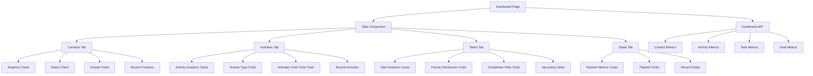

# Dashboard Tabs Implementation Plan

## Overview

Reorganize the dashboard to use tabs for separating analytics by section (Contacts, Activities, Tasks, Deals) to prevent the dashboard from becoming too long and overwhelming.

## Current Dashboard Structure

The current dashboard displays all analytics in a single vertical scroll:

```
Dashboard
├── Analytics Cards (Total Contacts, Leads, Customers, Conversion Rate)
├── Status Chart (Pie chart of leads vs customers)
├── Growth Chart (Contact growth over time)
├── Recent Contacts (Last 5 contacts)
├── Recent Activities (Last 5 activities)
├── Upcoming Tasks (Tasks due today + next 5 tasks)
├── Pipeline Metrics (Pipeline value, won value, lost value, win rate)
├── Pipeline Chart (Deals by stage)
└── Recent Deals (Last 5 deals)
```

**Problem**: As more features are added, the dashboard will become increasingly long and difficult to navigate.

## Proposed Tabbed Structure

### Tab 1: Contacts (Default)

- Analytics Cards (Total Contacts, Leads, Customers, Conversion Rate)
- Status Chart (Pie chart of leads vs customers)
- Growth Chart (Contact growth over time)
- Recent Contacts (Last 5 contacts)

### Tab 2: Activities

- Activity Analytics Cards (Total Activities, Activities by Type)
- Activity Type Distribution Chart
- Activities Over Time Chart
- Recent Activities (Last 5 activities)

### Tab 3: Tasks

- Task Analytics Cards (Total Tasks, Tasks Due Today, Overdue Tasks, Completed Tasks)
- Task Priority Distribution Chart
- Tasks Completion Rate Chart
- Upcoming Tasks (Tasks due today + next 5 tasks)

### Tab 4: Deals

- Pipeline Metrics Cards (Pipeline Value, Won Value, Lost Value, Win Rate)
- Pipeline Chart (Deals by stage)
- Recent Deals (Last 5 deals)

## Architecture Diagram



## Implementation Steps

### Step 1: Create New Analytics Components

#### 1.1 Activity Analytics Cards Component

**File**: `components/dashboard/activity-analytics-cards.tsx`

Display:

- Total Activities
- Activities by Type (Call, Email, Meeting, Note)
- Activities This Week
- Activities This Month

#### 1.2 Activity Type Distribution Chart Component

**File**: `components/dashboard/activity-type-chart.tsx`

Pie chart showing distribution of activity types (call, email, meeting, note)

#### 1.3 Activities Over Time Chart Component

**File**: `components/dashboard/activities-over-time-chart.tsx`

Line chart showing activity trends over the last 30 days

#### 1.4 Task Analytics Cards Component

**File**: `components/dashboard/task-analytics-cards.tsx`

Display:

- Total Tasks
- Tasks Due Today
- Overdue Tasks
- Completed Tasks

#### 1.5 Task Priority Distribution Chart Component

**File**: `components/dashboard/task-priority-chart.tsx`

Pie chart showing distribution of task priorities (low, medium, high)

#### 1.6 Tasks Completion Rate Chart Component

**File**: `components/dashboard/task-completion-chart.tsx`

Line chart showing task completion rate over time

#### 1.7 Pipeline Metrics Cards Component

**File**: `components/dashboard/pipeline-metrics-cards.tsx`

Display:

- Pipeline Value (total value of open deals)
- Won Value (total value of won deals)
- Lost Value (total value of lost deals)
- Win Rate (percentage of won vs closed deals)

### Step 2: Update Dashboard API

**File**: `app/api/dashboard/route.ts`

Add new metrics to the API response:

```typescript
interface DashboardData {
  // Existing contact metrics
  contacts: Contact[];
  recentActivities: Activity[];
  totalContacts: number;
  totalLeads: number;
  totalCustomers: number;
  conversionRate: number;
  growthData: { date: string; count: number }[];

  // Existing task metrics
  tasksDueToday: number;
  upcomingTasks: Task[];

  // Existing deal metrics
  pipelineValue: number;
  wonValue: number;
  lostValue: number;
  winRate: number;
  dealsByStage: Record<string, { value: number; count: number }>;
  recentDeals: any[];

  // NEW: Activity metrics
  totalActivities: number;
  activitiesByType: Record<string, number>;
  activitiesThisWeek: number;
  activitiesThisMonth: number;
  activitiesOverTime: { date: string; count: number }[];

  // NEW: Task metrics
  totalTasks: number;
  overdueTasks: number;
  completedTasks: number;
  tasksByPriority: Record<string, number>;
  taskCompletionRate: number;
  tasksCompletionOverTime: { date: string; rate: number }[];
}
```

Add database queries for new metrics:

- Count total activities
- Group activities by type
- Count activities this week/month
- Aggregate activities by date for time chart
- Count total tasks
- Count overdue tasks
- Count completed tasks
- Group tasks by priority
- Calculate task completion rate over time

### Step 3: Create Dashboard Tabs Component

**File**: `components/dashboard/dashboard-tabs.tsx`

Use shadcn/ui Tabs component to create the tab structure:

```typescript
import { Tabs, TabsContent, TabsList, TabsTrigger } from '@/components/ui/tabs';

export function DashboardTabs({ data }: { data: DashboardData }) {
  return (
    <Tabs defaultValue="contacts" className="w-full">
      <TabsList className="grid w-full grid-cols-4">
        <TabsTrigger value="contacts">Contacts</TabsTrigger>
        <TabsTrigger value="activities">Activities</TabsTrigger>
        <TabsTrigger value="tasks">Tasks</TabsTrigger>
        <TabsTrigger value="deals">Deals</TabsTrigger>
      </TabsList>

      <TabsContent value="contacts" className="space-y-6">
        {/* Contact analytics components */}
      </TabsContent>

      <TabsContent value="activities" className="space-y-6">
        {/* Activity analytics components */}
      </TabsContent>

      <TabsContent value="tasks" className="space-y-6">
        {/* Task analytics components */}
      </TabsContent>

      <TabsContent value="deals" className="space-y-6">
        {/* Deal analytics components */}
      </TabsContent>
    </Tabs>
  );
}
```

### Step 4: Refactor Main Dashboard Page

**File**: `app/page.tsx`

Replace the current vertical layout with the new tabbed structure:

```typescript
import { DashboardTabs } from '@/components/dashboard/dashboard-tabs';

export default function DashboardPage() {
  // Existing SWR fetch logic

  return (
    <div className="container space-y-8 py-8">
      <div className="space-y-6">
        <div>
          <h1 className="text-3xl font-bold tracking-tight">Dashboard</h1>
          <p className="text-muted-foreground">
            Overview of your contact database and analytics
          </p>
        </div>
      </div>

      <DashboardTabs data={data.data} />
    </div>
  );
}
```

### Step 5: Update Existing Components

#### 5.1 Update PipelineMetrics Component

**File**: `components/dashboard/pipeline-metrics.tsx`

Convert to card-based layout similar to AnalyticsCards component for consistency.

#### 5.2 Update RecentDeals Component

**File**: `components/dashboard/recent-deals.tsx`

Ensure it's compatible with the new tab structure.

### Step 6: Styling and Responsive Design

- Ensure tabs work well on mobile devices
- Use appropriate spacing between components within tabs
- Maintain consistent design language across all tabs
- Test on different screen sizes

### Step 7: Testing

- Test tab switching functionality
- Verify all data loads correctly for each tab
- Test responsive behavior on mobile/tablet/desktop
- Verify SWR revalidation still works with tabs
- Test task completion toggle in Tasks tab
- Test navigation links from recent items

## Data Flow

```mermaid
sequenceDiagram
    participant U as User
    participant D as Dashboard Page
    participant API as Dashboard API
    participant DB as Database

    U->>D: Load Dashboard
    D->>API: GET /api/dashboard
    API->>DB: Query all metrics
    DB-->>API: Return data
    API-->>D: Return all dashboard data
    D->>D: Render Tabs with Contacts tab active

    U->>D: Click Activities tab
    D->>D: Switch to Activities tab content
    Note: Data already loaded, no API call needed

    U->>D: Toggle task completion
    D->>API: PATCH /api/tasks/:id
    API->>DB: Update task
    API-->>D: Return updated task
    D->>D: Revalidate SWR cache
    D->>D: Update UI
```

## Benefits

1. **Improved UX**: Users can focus on one type of analytics at a time
2. **Scalability**: Easy to add new tabs for future features
3. **Reduced Cognitive Load**: Less overwhelming than a long scrolling page
4. **Better Organization**: Related analytics grouped together
5. **Performance**: All data loaded once, tab switching is instant
6. **Mobile Friendly**: Tabs work better on mobile than long scrolling pages

## Files to Create

1. `components/dashboard/activity-analytics-cards.tsx`
2. `components/dashboard/activity-type-chart.tsx`
3. `components/dashboard/activities-over-time-chart.tsx`
4. `components/dashboard/task-analytics-cards.tsx`
5. `components/dashboard/task-priority-chart.tsx`
6. `components/dashboard/task-completion-chart.tsx`
7. `components/dashboard/pipeline-metrics-cards.tsx`
8. `components/dashboard/dashboard-tabs.tsx`

## Files to Modify

1. `app/page.tsx` - Refactor to use dashboard tabs
2. `app/api/dashboard/route.ts` - Add new metrics
3. `components/dashboard/pipeline-metrics.tsx` - Convert to card layout
4. `components/dashboard/recent-deals.tsx` - Ensure compatibility

## Notes

- The shadcn/ui Tabs component is already installed and available
- SWR will continue to work as before, fetching all data at once
- Tab switching will be instant since all data is pre-loaded
- Each tab will have a consistent layout: cards at top, charts in middle, recent items at bottom
- Maintain the "intentional minimalism" design philosophy
- Use consistent color schemes across all tabs
