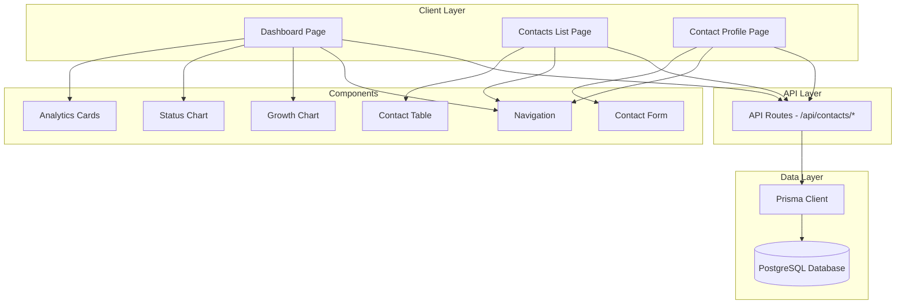

# CRM Contact Manager - Implementation Plan

## Overview

This plan outlines the step-by-step implementation of the CRM Contact Manager MVP, following the "intentional minimalism" design philosophy with Prisma as the ORM.

## System Architecture



## Implementation Phases

### Phase 1: Project Setup (Tasks 2-4)

Initialize the Next.js project with all necessary dependencies and configuration.

**Deliverables:**

- Next.js 14+ project with TypeScript
- Tailwind CSS configured
- shadcn/ui initialized
- All required dependencies installed

### Phase 2: Database Setup (Tasks 5-7)

Configure Prisma, create the database schema, and run initial migration.

**Database Schema:**

```prisma
model Contact {
  id          String   @id @default(uuid())
  firstName   String
  lastName    String
  email       String   @unique
  phoneNumber String?
  status      String   @default("lead")
  createdAt   DateTime @default(now())
  updatedAt   DateTime @updatedAt
}
```

**Deliverables:**

- Prisma schema defined
- Database created and migrated
- Prisma client configured

### Phase 3: Foundation Layer (Tasks 8-9)

Create the core types and validation schemas that will be used throughout the application.

**Deliverables:**

- TypeScript interfaces for Contact entity
- Zod validation schemas for form inputs
- Type-safe data structures

### Phase 4: API Layer (Tasks 10-14)

Build all CRUD API endpoints following the established pattern.

**API Endpoints:**

- `GET /api/contacts` - List all contacts
- `GET /api/contacts/[id]` - Get single contact
- `POST /api/contacts` - Create new contact
- `PUT /api/contacts/[id]` - Update contact
- `DELETE /api/contacts/[id]` - Delete contact

**Response Format:**

```typescript
{
  data: T | null,
  error: string | null
}
```

**Deliverables:**

- All API routes implemented
- Consistent error handling
- Proper HTTP status codes

### Phase 5: Layout & Navigation (Tasks 15-16)

Create the application shell with distinctive navigation.

**Design Considerations:**

- Anti-generic layout with unique typography
- Asymmetrical or unexpected composition
- Generous whitespace
- Distinctive visual hierarchy

**Deliverables:**

- Root layout with navigation
- Bespoke navigation component
- Responsive design

### Phase 6: Dashboard (Tasks 17-21)

Build the dashboard with analytics and visualizations.

**Components:**

- Analytics Cards (Total, Leads, Customers, Conversion Rate)
- Status Distribution Chart (Pie/Donut)
- Contact Growth Chart (Line)
- Recent Contacts List

**Deliverables:**

- Fully functional dashboard
- Real-time analytics
- Interactive charts with Recharts

### Phase 7: Contacts List (Tasks 22-25)

Build the contacts management interface.

**Features:**

- Contact table with selection
- Status filtering (All/Leads/Customers)
- Search by name or email
- Bulk delete with confirmation
- Pagination (if >50 contacts)

**Deliverables:**

- Contact list page
- Filtering and search
- Bulk operations

### Phase 8: Contact Profile (Tasks 26-29)

Build individual contact management.

**Features:**

- View contact details
- Edit mode with inline validation
- Delete with confirmation
- Timestamp display

**Deliverables:**

- Contact profile page
- Edit functionality
- Delete functionality

### Phase 9: Contact Creation (Tasks 30-32)

Build the contact creation flow.

**Features:**

- Contact form with validation
- Real-time error feedback
- Email uniqueness check
- Success/redirect flow

**Deliverables:**

- Contact form component
- Creation flow
- Integration with navigation

### Phase 10: Polish & Performance (Tasks 33-35)

Add loading states, animations, and design polish.

**Enhancements:**

- Loading states for all async operations
- Error boundaries and handling
- Motion animations for micro-interactions
- "Intentional minimalism" design refinement

**Deliverables:**

- Smooth user experience
- Professional polish
- Performance optimization

### Phase 11: Testing & Finalization (Task 36-37)

End-to-end testing and documentation updates.

**Activities:**

- Test all user flows
- Verify responsive design
- Check accessibility
- Update project documentation

**Deliverables:**

- Fully tested application
- Updated context.md
- Ready for deployment

## Design Philosophy Implementation

### "Intentional Minimalism" Approach

1. **Typography:**

   - Choose distinctive display font (e.g., Space Grotesk, Outfit, Syne)
   - Pair with refined body font (e.g., DM Sans, Inter with custom tracking)
   - Avoid generic fonts like Arial or default Inter

2. **Color Palette:**

   - Dominant neutral with sharp accent
   - Avoid purple gradients on white
   - Consider: warm neutrals with bold accent, or monochromatic with single pop
   - High contrast for accessibility

3. **Layout:**

   - Asymmetrical compositions
   - Generous whitespace
   - Unexpected element placement
   - Break grid when purposeful

4. **Motion:**

   - One orchestrated page load with staggered reveals
   - Subtle hover states
   - Smooth transitions
   - Avoid scattered micro-interactions

5. **Components:**
   - Wrap shadcn/ui components with custom styling
   - Add distinctive borders or shadows
   - Custom spacing and typography
   - Unique visual hierarchy

## Technical Patterns

### API Route Pattern

```typescript
export async function GET(request: NextRequest) {
  try {
    const data = await prisma.contact.findMany();
    return NextResponse.json({ data, error: null });
  } catch (error) {
    return NextResponse.json(
      { data: null, error: "Failed to fetch contacts" },
      { status: 500 }
    );
  }
}
```

### Form Validation Pattern

```typescript
const form = useForm<ContactInput>({
  resolver: zodResolver(contactSchema),
  defaultValues: { ... }
})
```

### Database Query Pattern

```typescript
const contacts = await prisma.contact.findMany({
  orderBy: { createdAt: "desc" },
});
```

## Success Criteria

- [ ] All CRUD operations working
- [ ] Dashboard analytics accurate
- [ ] Filtering and search functional
- [ ] Form validation working
- [ ] Responsive design on all devices
- [ ] Performance targets met (<2s load, <1s form submit)
- [ ] Design feels bespoke, not generic
- [ ] No console errors
- [ ] Accessibility compliant (WCAG AA)

## Next Steps

Once you approve this plan, I'll switch to Code mode to begin implementation starting with Phase 1: Project Setup.
