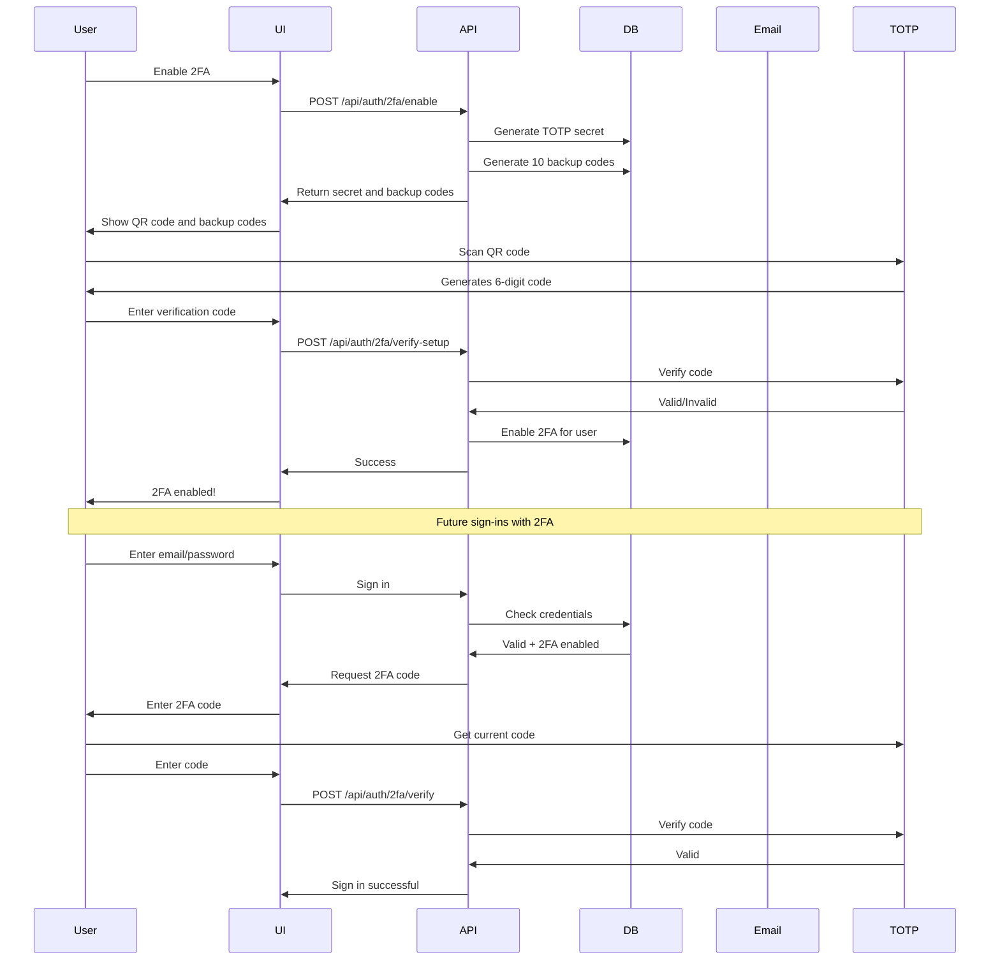
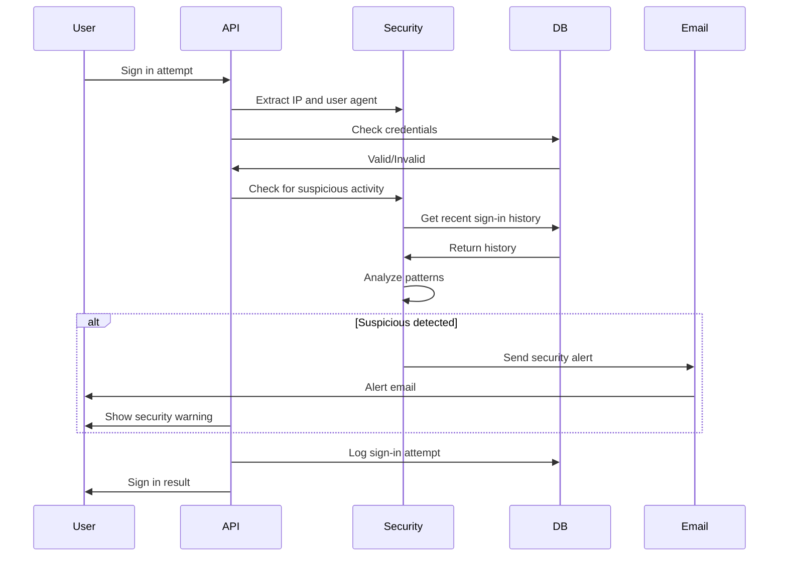
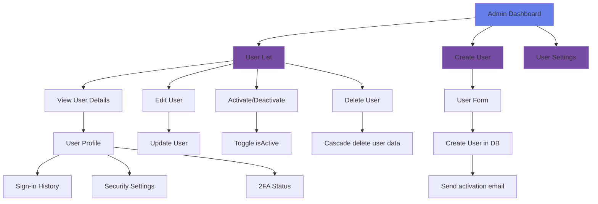

# Phase 3: Email Verification & Enhanced Security - Implementation Plan

## Executive Summary

Phase 3 builds upon the foundation laid in Phase 1 (database schema, authentication infrastructure) and Phase 2 (UI components and basic flows). This phase adds enterprise-grade security features including Two-Factor Authentication (2FA), IP tracking, security alerts, and admin user management capabilities.

**Current Status**: Foundation complete (email service, rate limiting, TOTP, security tracking libraries implemented)
**Estimated Complexity**: High - Multiple interconnected systems requiring careful integration
**Priority Order**: 2FA → IP Tracking → Admin Management → Middleware → Testing → Documentation

---

## Current Foundation (What's Already Done)

### Database Schema ✅

- User model with 2FA fields: `twoFactorEnabled`, `twoFactorSecret`, `emailVerified`, `lastSignInIp`, `lastSignInAt`
- SignInHistory model for tracking sign-in attempts
- TwoFactorBackupCode model for recovery codes
- All indexes and relationships in place

### Core Libraries ✅

- **Email Service** (`lib/email.ts`): Complete with Resend integration and all email templates
  - Verification emails
  - Password reset emails
  - 2FA code emails
  - Account activation/deactivation emails
  - Security alert emails

- **Rate Limiting** (`lib/rate-limit.ts`): Complete with Upstash Redis integration
  - Signup: 3 requests/hour
  - Signin: 10 requests/hour
  - Forgot password: 3 requests/hour
  - Reset password: 5 requests/hour
  - Verify email: 10 requests/hour
  - Enable 2FA: 3 requests/hour
  - Verify 2FA: 10 requests/hour

- **TOTP Implementation** (`lib/totp.ts`): Complete custom implementation
  - Generate TOTP secret (base32 encoded)
  - Generate TOTP codes (6-digit, 30-second window)
  - Verify TOTP codes
  - Generate backup codes (10 codes)
  - Generate QR code URL for authenticator apps
  - Validate TOTP setup

- **Security Tracking** (`lib/security.ts`): Complete with IP tracking
  - Extract IP address from request (handles x-forwarded-for, x-real-ip, cf-connecting-ip)
  - Extract user agent
  - Detect suspicious activity based on sign-in history
  - Log sign-in attempts
  - Get user's sign-in history
  - Basic VPN/proxy detection (placeholder for production services)

### API Routes ✅

- POST /api/auth/signup (user registration)
- POST /api/auth/forgot-password (password reset request)
- POST /api/auth/reset-password (password reset with token)
- POST /api/auth/verify-email (email verification)

### UI Components ✅

- Sign-in form
- Sign-up form
- Forgot password form
- Reset password form
- Password strength indicator
- Auth layout wrapper

### Environment Variables Required

```env
# Email Service (Resend)
RESEND_API_KEY=your_resend_api_key
RESEND_FROM_EMAIL=noreply@yourdomain.com

# Rate Limiting (Upstash Redis)
UPSTASH_REDIS_REST_URL=your_redis_url
UPSTASH_REDIS_REST_TOKEN=your_redis_token

# NextAuth
NEXTAUTH_SECRET=your_secret_key
NEXTAUTH_URL=http://localhost:3000
```

---

## Implementation Architecture

### 1. Two-Factor Authentication (2FA) Flow



### 2. IP Tracking and Security Alerts Flow



### 3. Admin User Management Flow



---

## Detailed Implementation Plan

### Phase 3.1: Two-Factor Authentication (2FA)

**Objective**: Implement TOTP-based 2FA with backup codes for recovery.

**Files to Create**:

1. `app/auth/2fa-setup/page.tsx` - 2FA setup page with QR code
2. `app/auth/verify-2fa/page.tsx` - 2FA verification page during sign-in
3. `components/auth/2fa-settings.tsx` - 2FA settings component
4. `components/auth/qr-code.tsx` - QR code display component
5. `components/auth/backup-codes.tsx` - Backup codes display component

**API Endpoints to Create**:

1. `POST /api/auth/2fa/enable` - Generate TOTP secret and backup codes
2. `POST /api/auth/2fa/verify-setup` - Verify user can generate correct TOTP code
3. `POST /api/auth/2fa/disable` - Disable 2FA for user
4. `POST /api/auth/2fa/verify` - Verify 2FA code during sign-in
5. `POST /api/auth/2fa/regenerate-codes` - Regenerate backup codes

**Implementation Details**:

**Enable 2FA** (`POST /api/auth/2fa/enable`):

```typescript
// Request: { userId: string }
// Response: { secret: string, qrCodeUrl: string, backupCodes: string[] }

1. Check rate limit (3 requests/hour per user)
2. Generate TOTP secret using lib/totp.ts
3. Generate 10 backup codes using lib/totp.ts
4. Store backup codes in TwoFactorBackupCode table (not enabled yet)
5. Return secret, QR code URL, and backup codes
```

**Verify Setup** (`POST /api/auth/2fa/verify-setup`):

```typescript
// Request: { userId: string, code: string }
// Response: { success: boolean }

1. Check rate limit (3 requests/hour per user)
2. Get user's temporary secret (stored in session or cache)
3. Verify TOTP code using lib/totp.ts
4. If valid:
   - Store twoFactorSecret in User model
   - Set twoFactorEnabled = true
   - Mark backup codes as active
5. Return success
```

**Verify 2FA** (`POST /api/auth/2fa/verify`):

```typescript
// Request: { userId: string, code: string }
// Response: { success: boolean, method: 'totp' | 'backup' }

1. Check rate limit (10 requests/hour per user)
2. Try TOTP verification first
3. If TOTP fails, try backup code verification
4. If backup code used, mark it as used
5. Return success with method used
```

**UI Flow**:

1. User goes to settings → Security → Enable 2FA
2. Show QR code for authenticator app (Google Authenticator, Authy, etc.)
3. Show backup codes (one-time display)
4. User scans QR code with authenticator app
5. User enters 6-digit code from app
6. System verifies code
7. 2FA enabled - future sign-ins require code

**Backup Codes**:

- 10 codes generated when 2FA is enabled
- Each code can be used once
- User should store securely (print or save offline)
- Can regenerate codes (invalidates old ones)

**Dependencies**:

- `qrcode` library for QR code generation (already installed)
- Custom TOTP implementation (already in `lib/totp.ts`)

**Known Issue**: OTPAuth library has incorrect exports - using custom implementation instead.

---

### Phase 3.2: IP Tracking and Security Alerts

**Objective**: Track sign-in attempts, detect suspicious activity, and send security alerts.

**Files to Create**:

1. `app/settings/security/page.tsx` - Security settings page
2. `components/auth/sign-in-history.tsx` - Sign-in history component
3. `components/auth/security-alerts.tsx` - Security alerts component
4. `components/auth/ip-location.tsx` - IP location display component

**API Endpoints to Create**:

1. `GET /api/auth/security/history` - Get user's sign-in history
2. `POST /api/auth/security/alert` - Trigger manual security alert
3. `GET /api/auth/security/stats` - Get security statistics

**Implementation Details**:

**Integrate into Sign-in Flow**:

```typescript
// In POST /api/auth/[...nextauth]/route.ts

1. Extract IP address using lib/security.ts.getClientIP()
2. Extract user agent using lib/security.ts.getUserAgent()
3. Check credentials
4. Log sign-in attempt using lib/security.ts.logSignInAttempt()
5. Check for suspicious activity using lib/security.ts.detectSuspiciousActivity()
6. If suspicious:
   - Send security alert email using lib/email.ts.sendSecurityAlertEmail()
   - Show warning to user
7. Update user's lastSignInIp and lastSignInAt
```

**Sign-in History**:

```typescript
// GET /api/auth/security/history
// Response: { history: SignInHistory[] }

1. Get current user from session
2. Fetch last 20 sign-in attempts from SignInHistory table
3. Include: IP address, user agent, success/failure, timestamp
4. Return paginated results
```

**Suspicious Activity Detection**:
Already implemented in `lib/security.ts.detectSuspiciousActivity()`:

- Multiple failed attempts from same IP (5+ in 24 hours)
- Sign-in from new IP after multiple different IPs used
- Multiple sign-in attempts from different IPs in short time (10 minutes)

**Security Alerts**:

- Email template already in `lib/email.ts.emailTemplates.securityAlert`
- Includes alert type and details
- Sent when suspicious activity detected
- Can also be triggered manually by user

**IP Geolocation** (Optional Enhancement):

- Use free service like ipapi.co or ip-api.com
- Display city/country in sign-in history
- Help users recognize legitimate sign-ins

**UI Components**:

- Sign-in history table with:
  - Date/time
  - IP address
  - Location (if geolocation enabled)
  - Device/browser (from user agent)
  - Success/failure status
  - Failure reason (if applicable)

- Security settings page with:
  - Sign-in history
  - Active sessions (future enhancement)
  - Security alerts
  - 2FA settings
  - Account status

---

### Phase 3.3: Admin User Management

**Objective**: Enable admins to manage user accounts (create, update, activate, deactivate, delete).

**Files to Create**:

1. `app/admin/users/page.tsx` - Admin dashboard for user management
2. `components/admin/user-table.tsx` - User list table
3. `components/admin/user-form.tsx` - User creation/edit form
4. `components/admin/user-actions.tsx` - User action buttons (activate/deactivate/delete)
5. `middleware/admin.ts` - Admin route protection middleware

**API Endpoints to Create**:

1. `GET /api/admin/users` - List all users with pagination
2. `POST /api/admin/users` - Create new user
3. `GET /api/admin/users/[id]` - Get single user details
4. `PUT /api/admin/users/[id]` - Update user
5. `DELETE /api/admin/users/[id]` - Delete user
6. `POST /api/admin/users/[id]/activate` - Activate user account
7. `POST /api/admin/users/[id]/deactivate` - Deactivate user account

**Implementation Details**:

**List Users** (`GET /api/admin/users`):

```typescript
// Query params: page, limit, search, role, status
// Response: { users: User[], total: number, page: number, limit: number }

1. Check admin role (requireRole('admin'))
2. Build query filters from params
3. Fetch users with pagination
4. Include related data (contacts count, deals count, etc.)
5. Return paginated results
```

**Create User** (`POST /api/admin/users`):

```typescript
// Request: { email, name, password, role, isActive }
// Response: { user: User }

1. Check admin role
2. Validate input (email uniqueness, password strength)
3. Hash password with bcrypt
4. Create user in database
5. If isActive is false, send activation email
6. Return created user
```

**Update User** (`PUT /api/admin/users/[id]`):

```typescript
// Request: { name, role, isActive, bio, avatar }
// Response: { user: User }

1. Check admin role
2. Validate input
3. Update user in database
4. If isActive changed from false to true, send activation email
5. If isActive changed from true to false, send deactivation email
6. Return updated user
```

**Delete User** (`DELETE /api/admin/users/[id]`):

```typescript
// Response: { success: boolean }

1. Check admin role
2. Prevent deleting own account
3. Cascade delete all user data (contacts, deals, tasks, activities)
4. Delete user
5. Return success
```

**Admin Middleware**:

```typescript
// middleware/admin.ts

1. Check if user is authenticated
2. Check if user has admin role
3. If not admin, redirect to unauthorized page
4. Allow access to admin routes
```

**UI Components**:

- User table with:
  - Name and email
  - Role badge (admin, manager, rep)
  - Status badge (active, inactive)
  - 2FA status
  - Last sign-in
  - Actions (edit, activate/deactivate, delete)

- User form with:
  - Name
  - Email
  - Password (for new users)
  - Role selection
  - Active status toggle
  - Bio (optional)
  - Avatar (optional)

- Admin dashboard with:
  - User statistics (total, active, inactive)
  - Quick actions (create user)
  - Search and filters
  - User list

**Navigation**:

- Add "Admin" link to navigation (only visible to admin users)
- Add "Settings" link to navigation (all authenticated users)
- Settings dropdown with:
  - Profile
  - Security
  - Sign out

---

### Phase 3.4: Middleware Re-enablement

**Objective**: Re-enable middleware for protected routes using NextAuth's built-in middleware.

**Current Issue**: Middleware was disabled in Phase 2 due to bcrypt import causing edge runtime error.

**Solution**: Use NextAuth's built-in middleware which doesn't require bcrypt.

**Implementation**:

```typescript
// middleware.ts
import { withAuth } from 'next-auth/middleware';

export default withAuth({
  pages: {
    signIn: '/auth/signin',
  },
});

export const config = {
  matcher: [
    /*
     * Match all request paths except:
     * - api/auth/* (NextAuth routes)
     * - api/public/* (public API routes)
     * - _next/static (static files)
     * - _next/image (image optimization files)
     * - favicon.ico (favicon file)
     * - public folder (public files)
     */
    '/((?!api/auth|api/public|_next/static|_next/image|favicon.ico|public).*)',
  ],
};
```

**Additional Middleware for Admin Routes**:

```typescript
// middleware/admin.ts
import { withAuth } from 'next-auth/middleware';
import { NextResponse } from 'next/server';

export default withAuth({
  pages: {
    signIn: '/auth/signin',
    error: '/auth/error',
  },
  callbacks: {
    authorized: ({ token }) => {
      return token?.role === 'admin';
    },
  },
});

export const config = {
  matcher: ['/admin/:path*'],
};
```

**Testing**:

1. Test protected routes redirect to sign-in
2. Test sign-in redirects to dashboard
3. Test authenticated users can access protected routes
4. Test non-admin users cannot access admin routes
5. Test API routes are not blocked

---

### Phase 3.5: Email Verification Flow Completion

**Objective**: Require email verification before users can sign in.

**Current State**: Email verification endpoint exists but is not enforced.

**Implementation**:

**Update Sign-up Flow**:

```typescript
// POST /api/auth/signup

1. Create user with emailVerified = null
2. Generate verification token
3. Send verification email
4. Return success with message: "Please check your email to verify your account"
5. Do NOT automatically sign in user
```

**Update Sign-in Flow**:

```typescript
// POST /api/auth/[...nextauth]/route.ts

1. Check credentials
2. If valid, check emailVerified field
3. If emailVerified is null:
   - Return error: "Please verify your email before signing in"
   - Show "Resend verification email" button
4. If emailVerified is not null, proceed with sign-in
```

**Resend Verification Email** (`POST /api/auth/resend-verification`):

```typescript
// Request: { email }
// Response: { success: boolean }

1. Check rate limit (3 requests/hour per email)
2. Find user by email
3. If not found, return success (security: don't reveal email existence)
4. If email already verified, return error
5. Generate new verification token
6. Send verification email
7. Return success
```

**UI Updates**:

1. Sign-up page: Show "Verification email sent" message after successful sign-up
2. Sign-in page: Add "Resend verification email" link when verification is required
3. Verify email page: Show success/error messages

---

### Phase 3.6: End-to-End Testing

**Objective**: Test all authentication and security features comprehensively.

**Test Plan**:

**1. Email Verification Flow**

- [ ] Sign up with new email
- [ ] Receive verification email
- [ ] Click verification link
- [ ] Sign in successfully
- [ ] Try to sign in without verification (should fail)
- [ ] Resend verification email
- [ ] Test expired verification link

**2. Sign-in Flow**

- [ ] Sign in with correct credentials
- [ ] Sign in with incorrect email
- [ ] Sign in with incorrect password
- [ ] Sign in with inactive account (should fail)
- [ ] Sign in with unverified email (should fail)
- [ ] Sign in with 2FA enabled
- [ ] Sign in with 2FA using TOTP code
- [ ] Sign in with 2FA using backup code
- [ ] Sign in with incorrect 2FA code (should fail)
- [ ] Sign in with used backup code (should fail)

**3. 2FA Flow**

- [ ] Enable 2FA
- [ ] Scan QR code with authenticator app
- [ ] Verify setup with correct code
- [ ] Verify setup with incorrect code (should fail)
- [ ] Sign in with 2FA enabled
- [ ] Disable 2FA
- [ ] Regenerate backup codes
- [ ] Use backup code for sign-in
- [ ] Verify backup code is marked as used

**4. Password Reset Flow**

- [ ] Request password reset
- [ ] Receive reset email
- [ ] Click reset link
- [ ] Reset password with valid data
- [ ] Sign in with new password
- [ ] Try to use old password (should fail)
- [ ] Test expired reset link

**5. Rate Limiting**

- [ ] Test signup rate limit (3 requests/hour)
- [ ] Test signin rate limit (10 requests/hour)
- [ ] Test forgot password rate limit (3 requests/hour)
- [ ] Test reset password rate limit (5 requests/hour)
- [ ] Test verify email rate limit (10 requests/hour)
- [ ] Test enable 2FA rate limit (3 requests/hour)
- [ ] Test verify 2FA rate limit (10 requests/hour)
- [ ] Test Redis connection failure (should fail open)

**6. IP Tracking and Security**

- [ ] Sign in from different IP
- [ ] Check sign-in history
- [ ] Trigger suspicious activity detection
- [ ] Receive security alert email
- [ ] View security settings page
- [ ] Check IP location display

**7. Admin User Management**

- [ ] Create new user as admin
- [ ] List all users
- [ ] Filter users by role
- [ ] Search users by name/email
- [ ] Update user details
- [ ] Activate inactive user
- [ ] Deactivate active user
- [ ] Delete user
- [ ] Try to access admin routes as non-admin (should fail)

**8. Middleware**

- [ ] Access protected route without authentication (redirect to sign-in)
- [ ] Access sign-in page while authenticated (redirect to dashboard)
- [ ] Access admin route as non-admin (redirect to unauthorized)
- [ ] Access API routes (should not be blocked)

**9. Session Management**

- [ ] Sign out successfully
- [ ] Session expires correctly
- [ ] Multiple sessions (future enhancement)
- [ ] Session persistence across page refreshes

**10. Edge Cases**

- [ ] Sign in with deactivated account
- [ ] Sign in with deleted account
- [ ] Reset password for non-existent email (security: don't reveal)
- [ ] Verify email for non-existent token
- [ ] Enable 2FA for account with existing 2FA
- [ ] Disable 2FA for account without 2FA
- [ ] Use backup code after 2FA disabled
- [ ] Regenerate backup codes multiple times

---

### Phase 3.7: Documentation Updates

**Objective**: Document all new features and update existing documentation.

**Files to Update**:

1. **`.kilocode/rules/memory-bank/authentication.md`**
   - Add Phase 3 completion details
   - Document 2FA implementation
   - Document IP tracking and security alerts
   - Document admin user management
   - Update success criteria
   - Update testing notes

2. **`.kilocode/rules/memory-bank/context.md`**
   - Update current work focus
   - Update project status
   - Add recent changes for Phase 3
   - Update immediate next steps

3. **`.kilocode/rules/memory-bank/architecture.md`**
   - Add 2FA flow diagram
   - Add IP tracking flow diagram
   - Add admin management flow diagram
   - Update component relationships
   - Update critical implementation paths
   - Add security considerations

4. **`README.md`**
   - Add authentication features section
   - Document 2FA setup
   - Document security features
   - Document admin management
   - Update environment variables
   - Add security best practices
   - Update testing section

5. **`docs/security/page.tsx`**
   - Create comprehensive security documentation
   - Document 2FA
   - Document IP tracking
   - Document security alerts
   - Document rate limiting
   - Document best practices

6. **Environment Variables Documentation**

   ```env
   # Email Service (Resend)
   RESEND_API_KEY=your_resend_api_key
   RESEND_FROM_EMAIL=noreply@yourdomain.com

   # Rate Limiting (Upstash Redis)
   UPSTASH_REDIS_REST_URL=your_redis_url
   UPSTASH_REDIS_REST_TOKEN=your_redis_token

   # NextAuth
   NEXTAUTH_SECRET=your_secret_key
   NEXTAUTH_URL=http://localhost:3000
   ```

7. **Rate Limiting Configuration Documentation**
   - Document all rate limiters
   - Document how to customize limits
   - Document Redis setup
   - Document fail-open behavior

8. **Testing Checklist**
   - Create comprehensive testing checklist
   - Document test scenarios
   - Document expected results
   - Document troubleshooting

---

### Phase 3.8: Bug Fixes and Refinements

**Known Issues**:

1. **OTPAuth Library Incorrect Exports**
   - **Issue**: OTPAuth library has incorrect exports
   - **Solution**: Use custom TOTP implementation (already done in `lib/totp.ts`)
   - **Status**: ✅ Resolved

2. **Email Templates**
   - **Task**: Verify all email templates render correctly
   - **Action**: Test each template with sample data
   - **Status**: ⏳ Pending

3. **Rate Limiting with Redis Failures**
   - **Task**: Test rate limiting when Redis is unavailable
   - **Expected Behavior**: Fail open (allow requests)
   - **Status**: ⏳ Pending

4. **TOTP Code Generation**
   - **Task**: Verify TOTP codes match authenticator apps
   - **Action**: Test with Google Authenticator, Authy, etc.
   - **Status**: ⏳ Pending

5. **QR Code Generation**
   - **Task**: Test QR code generation and scanning
   - **Action**: Generate QR code, scan with authenticator app
   - **Status**: ⏳ Pending

6. **Backup Codes**
   - **Task**: Verify backup codes work correctly
   - **Action**: Use backup codes, verify they're marked as used
   - **Status**: ⏳ Pending

7. **Security Alert Emails**
   - **Task**: Test security alert email delivery
   - **Action**: Trigger security alert, verify email received
   - **Status**: ⏳ Pending

8. **Sign-in History Pagination**
   - **Task**: Verify sign-in history pagination works
   - **Action**: Create many sign-in attempts, test pagination
   - **Status**: ⏳ Pending

---

## Implementation Order

### Priority 1: Core Security Features (Week 1)

1. Two-Factor Authentication (2FA)
   - API endpoints
   - UI components
   - Integration with sign-in flow

2. IP Tracking and Security Alerts
   - Integration into sign-in flow
   - Sign-in history API
   - Security settings page

### Priority 2: Admin Management (Week 2)

3. Admin User Management
   - API endpoints
   - UI components
   - Admin middleware

4. Middleware Re-enablement
   - Fix middleware
   - Test protected routes

### Priority 3: Email Verification (Week 2)

5. Email Verification Flow Completion
   - Enforce email verification
   - Resend verification email
   - UI updates

### Priority 4: Testing and Documentation (Week 3)

6. End-to-End Testing
   - Test all features
   - Fix bugs
   - Refine UX

7. Documentation Updates
   - Update memory bank
   - Create security documentation
   - Update README

---

## Success Criteria

### Phase 3.1: 2FA

- [ ] Users can enable 2FA with TOTP
- [ ] QR code generates correctly
- [ ] Authenticator apps can scan QR code
- [ ] TOTP codes verify correctly
- [ ] Backup codes work correctly
- [ ] 2FA is required during sign-in when enabled
- [ ] Users can disable 2FA
- [ ] Users can regenerate backup codes

### Phase 3.2: IP Tracking and Security

- [ ] Sign-in attempts are logged
- [ ] IP addresses are tracked
- [ ] Suspicious activity is detected
- [ ] Security alert emails are sent
- [ ] Sign-in history is displayed
- [ ] Security settings page works

### Phase 3.3: Admin Management

- [ ] Admins can list all users
- [ ] Admins can create users
- [ ] Admins can update users
- [ ] Admins can delete users
- [ ] Admins can activate/deactivate users
- [ ] Admin routes are protected
- [ ] Non-admins cannot access admin routes

### Phase 3.4: Middleware

- [ ] Protected routes redirect to sign-in
- [ ] Auth pages redirect authenticated users
- [ ] API routes are not blocked
- [ ] Admin routes require admin role

### Phase 3.5: Email Verification

- [ ] Users must verify email before signing in
- [ ] Verification emails are sent
- [ ] Verification links work
- [ ] Users can resend verification email
- [ ] Expired links are handled

### Phase 3.6: Testing

- [ ] All test scenarios pass
- [ ] No critical bugs remain
- [ ] UX is polished
- [ ] Performance is acceptable

### Phase 3.7: Documentation

- [ ] Memory bank is updated
- [ ] Security documentation is created
- [ ] README is updated
- [ ] Environment variables are documented
- [ ] Testing checklist is created

### Phase 3.8: Bug Fixes

- [ ] All known issues are resolved
- [ ] Email templates render correctly
- [ ] Rate limiting works with Redis failures
- [ ] TOTP codes match authenticator apps
- [ ] QR codes scan correctly
- [ ] Backup codes work correctly
- [ ] Security alert emails are delivered
- [ ] Sign-in history pagination works

---

## Risk Assessment

### High Risk

1. **TOTP Implementation**
   - **Risk**: TOTP codes don't match authenticator apps
   - **Mitigation**: Test with multiple authenticator apps (Google Authenticator, Authy, Microsoft Authenticator)
   - **Fallback**: Use alternative TOTP library if needed

2. **Email Delivery**
   - **Risk**: Emails not delivered or marked as spam
   - **Mitigation**: Configure SPF, DKIM, DMARC records
   - **Fallback**: Use alternative email service (SendGrid, Mailgun)

3. **Redis Connection**
   - **Risk**: Redis connection fails, rate limiting breaks
   - **Mitigation**: Fail-open behavior (allow requests if Redis is down)
   - **Fallback**: Use in-memory rate limiting for development

### Medium Risk

1. **Middleware Conflicts**
   - **Risk**: Middleware blocks legitimate requests
   - **Mitigation**: Thorough testing of all routes
   - **Fallback**: Disable middleware temporarily if issues arise

2. **2FA Backup Codes**
   - **Risk**: Users lose backup codes, get locked out
   - **Mitigation**: Provide clear warnings, allow admin reset
   - **Fallback**: Admin can disable 2FA for locked-out users

3. **Security Alert Fatigue**
   - **Risk**: Too many alerts, users ignore them
   - **Mitigation**: Tune suspicious activity detection thresholds
   - **Fallback**: Allow users to customize alert settings

### Low Risk

1. **UI/UX Issues**
   - **Risk**: Confusing 2FA setup process
   - **Mitigation**: Clear instructions, step-by-step guidance
   - **Fallback**: User feedback and iterative improvements

2. **Performance**
   - **Risk**: Security checks slow down sign-in
   - **Mitigation**: Optimize database queries, cache results
   - **Fallback**: Async security checks (background)

---

## Next Steps

1. **Review this plan** with the team
2. **Prioritize features** based on business needs
3. **Set up development environment** with all required services (Resend, Upstash Redis)
4. **Begin implementation** starting with Priority 1 features
5. **Test incrementally** after each feature is implemented
6. **Gather feedback** from stakeholders
7. **Refine and iterate** based on feedback

---

## Questions for Stakeholders

1. **2FA**: Should we require 2FA for all users or make it optional?
2. **Email Verification**: Should we allow users to use the app without verification (read-only)?
3. **Admin Management**: Should admins be able to reset user passwords?
4. **Security Alerts**: What thresholds should trigger security alerts?
5. **Rate Limiting**: Are the current rate limits appropriate for our use case?
6. **IP Geolocation**: Should we implement IP geolocation for sign-in history?
7. **Backup Codes**: How many backup codes should we generate? (Currently 10)
8. **Session Management**: Should we implement multiple session management?
9. **Password Requirements**: Should we enforce password complexity requirements?
10. **Account Deletion**: Should we implement account self-deletion for users?

---

## Conclusion

Phase 3 adds enterprise-grade security features to the CRM Contact Manager. The foundation is already in place (email service, rate limiting, TOTP, security tracking), so implementation should be straightforward. The main challenges are:

1. **Integration**: Ensuring all security features work together seamlessly
2. **UX**: Making security features easy to use without compromising security
3. **Testing**: Comprehensive testing to ensure all edge cases are covered
4. **Documentation**: Clear documentation for users and developers

With careful planning and incremental implementation, Phase 3 can be completed successfully within 3 weeks.

---

**Document Version**: 1.0
**Last Updated**: January 2, 2026
**Status**: Ready for Review
