# Search & Filtering Feature - Visual Diagrams

## 1. System Architecture Overview

```mermaid
graph TB
    subgraph "User Interface Layer"
        User[User]
        Nav[Navigation Component]
        GlobalSearch[Global Search Bar]
        ListPages[List Pages]
    end

    subgraph "Search Components"
        SearchDropdown[Search Results Dropdown]
        SearchHistory[Search History]
        AdvancedFilters[Advanced Filter Builder]
        SavedFilters[Saved Filters]
    end

    subgraph "API Layer"
        SearchAPI[/api/search]
        ContactsAPI[/api/contacts]
        CompaniesAPI[/api/companies]
        DealsAPI[/api/deals]
        TasksAPI[/api/tasks]
        ActivitiesAPI[/api/activities]
    end

    subgraph "Data Layer"
        Prisma[Prisma ORM]
        Database[(PostgreSQL)]
    end

    subgraph "Client Storage"
        LocalStorage[localStorage]
        URLParams[URL Parameters]
    end

    User --> Nav
    User --> ListPages
    Nav --> GlobalSearch
    ListPages --> AdvancedFilters
    ListPages --> SavedFilters

    GlobalSearch --> SearchDropdown
    GlobalSearch --> SearchHistory
    SearchHistory --> LocalStorage

    GlobalSearch --> SearchAPI
    AdvancedFilters --> ContactsAPI
    AdvancedFilters --> CompaniesAPI
    AdvancedFilters --> DealsAPI
    AdvancedFilters --> TasksAPI
    AdvancedFilters --> ActivitiesAPI

    ListPages --> URLParams
    URLParams --> ListPages

    SearchAPI --> Prisma
    ContactsAPI --> Prisma
    CompaniesAPI --> Prisma
    DealsAPI --> Prisma
    TasksAPI --> Prisma
    ActivitiesAPI --> Prisma

    Prisma --> Database
```

## 2. Global Search Flow

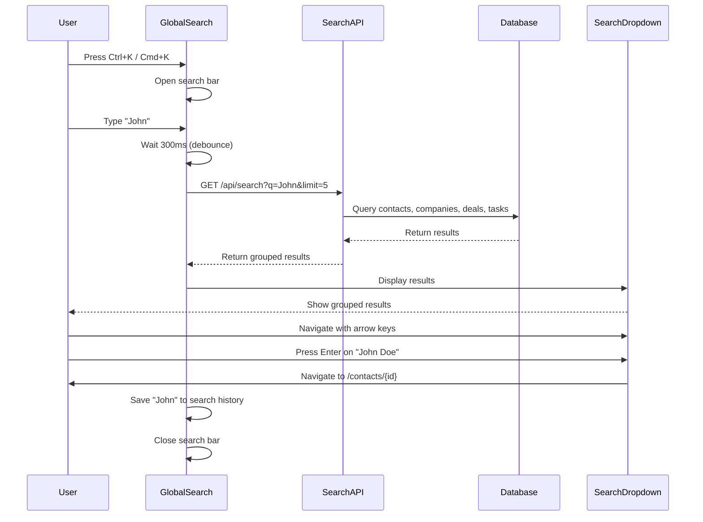

## 3. Advanced Filter Builder Flow

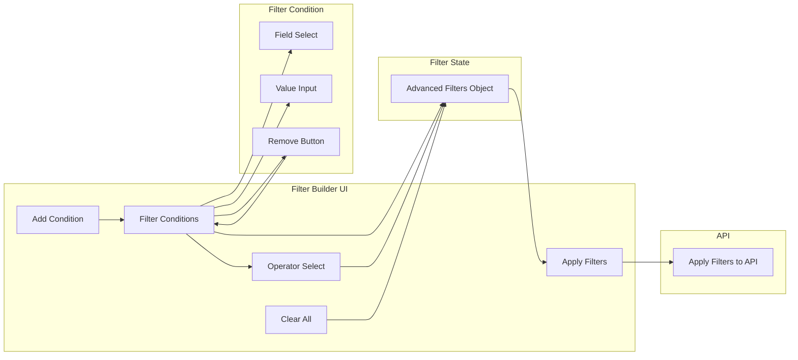

## 4. Saved Filters Flow

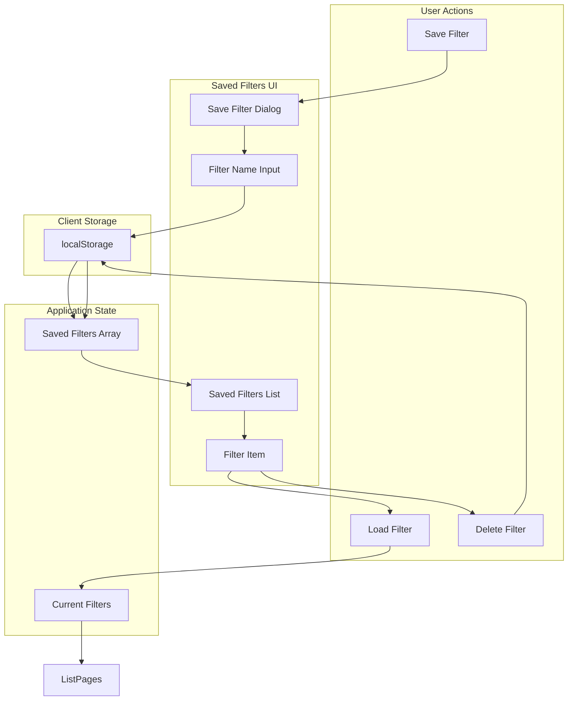

## 5. URL Parameter Sync Flow

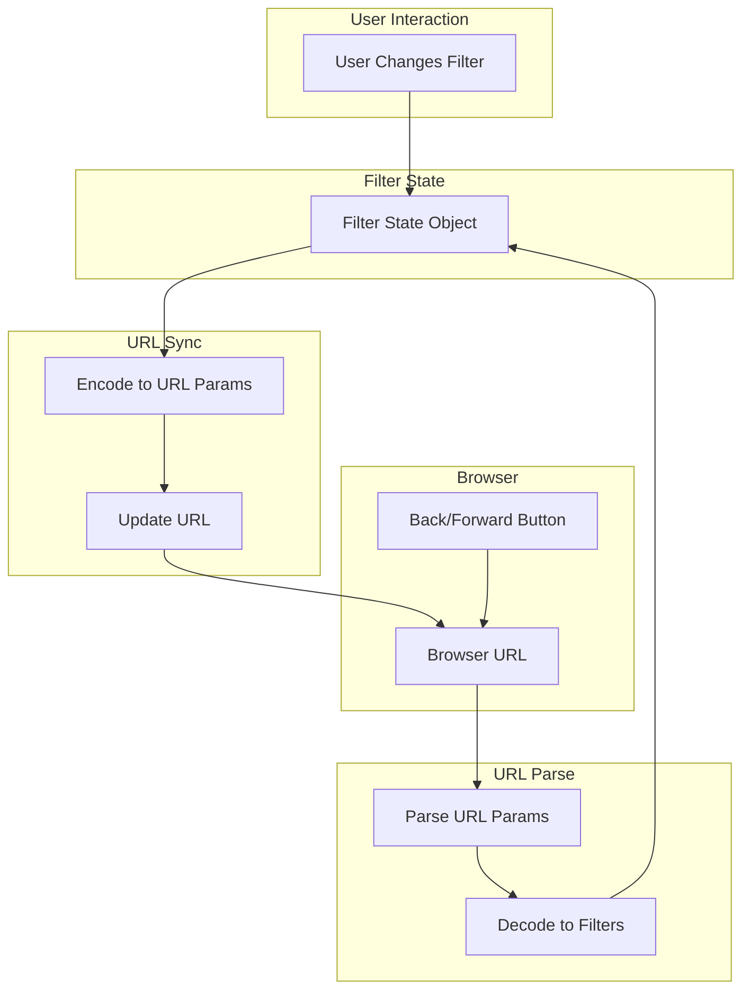

## 6. Component Hierarchy

```mermaid
graph TB
    subgraph "Navigation"
        Navigation[Navigation Component]
        GlobalSearch[Global Search Bar]
    end

    subgraph "Search Components"
        SearchDropdown[Search Results Dropdown]
        SearchResults[Search Results]
        SearchItem[Search Result Item]
        SearchHistory[Search History]
    end

    subgraph "Filter Components"
        BasicFilters[Basic Filters]
        AdvancedFilters[Advanced Filter Builder]
        FilterCondition[Filter Condition]
        FilterField[Filter Field Select]
        FilterOperator[Filter Operator Select]
        FilterValue[Filter Value Input]
    end

    subgraph "Saved Filters"
        SavedDropdown[Saved Filters Dropdown]
        SaveDialog[Save Filter Dialog]
        SavedList[Saved Filters List]
        SavedItem[Saved Filter Item]
    end

    Navigation --> GlobalSearch
    GlobalSearch --> SearchDropdown
    SearchDropdown --> SearchResults
    SearchResults --> SearchItem
    GlobalSearch --> SearchHistory

    BasicFilters --> AdvancedFilters
    AdvancedFilters --> FilterCondition
    FilterCondition --> FilterField
    FilterCondition --> FilterOperator
    FilterCondition --> FilterValue

    BasicFilters --> SavedDropdown
    SavedDropdown --> SaveDialog
    SavedDropdown --> SavedList
    SavedList --> SavedItem
```

## 7. Data Flow Diagram

```mermaid
graph LR
    subgraph "User Input"
        Search[Search Query]
        Filters[Filter Conditions]
        Sort[Sort Options]
    end

    subgraph "Client Processing"
        Debounce[Debounce 300ms]
        Validate[Validate Input]
        EncodeURL[Encode URL Params]
        SaveHistory[Save to History]
    end

    subgraph "API Request"
        APIEndpoint[API Endpoint]
        QueryParams[Query Parameters]
    end

    subgraph "Server Processing"
        PrismaQuery[Prisma Query]
        Database[Database Query]
        Results[Query Results]
    end

    subgraph "Response"
        Response[JSON Response]
        Error[Error Handling]
    end

    subgraph "Client Display"
        UpdateUI[Update UI]
        ShowResults[Display Results]
        ShowError[Show Error Message]
    end

    Search --> Debounce
    Filters --> Validate
    Sort --> Validate

    Debounce --> APIEndpoint
    Validate --> EncodeURL
    EncodeURL --> QueryParams
    QueryParams --> APIEndpoint

    APIEndpoint --> PrismaQuery
    PrismaQuery --> Database
    Database --> Results
    Results --> Response

    Response --> UpdateUI
    UpdateUI --> ShowResults
    Error --> ShowError

    Search --> SaveHistory
```

## 8. Filter State Management

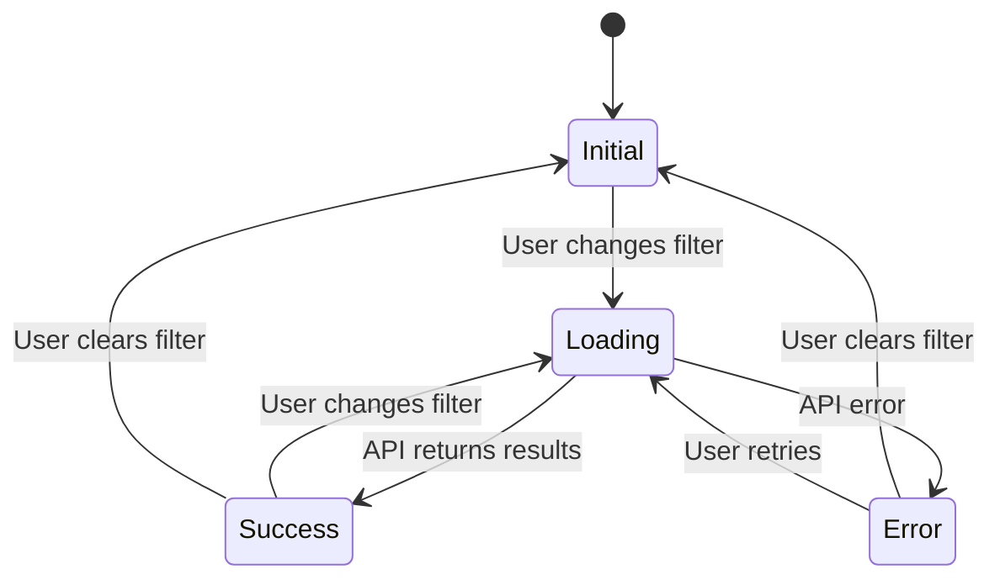

## 9. Global Search Keyboard Navigation

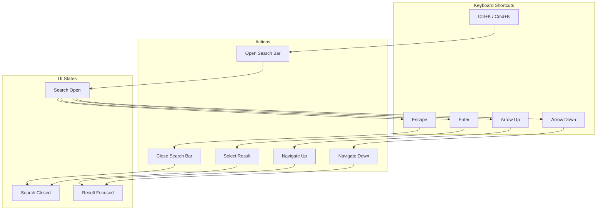

## 10. Implementation Phases Timeline

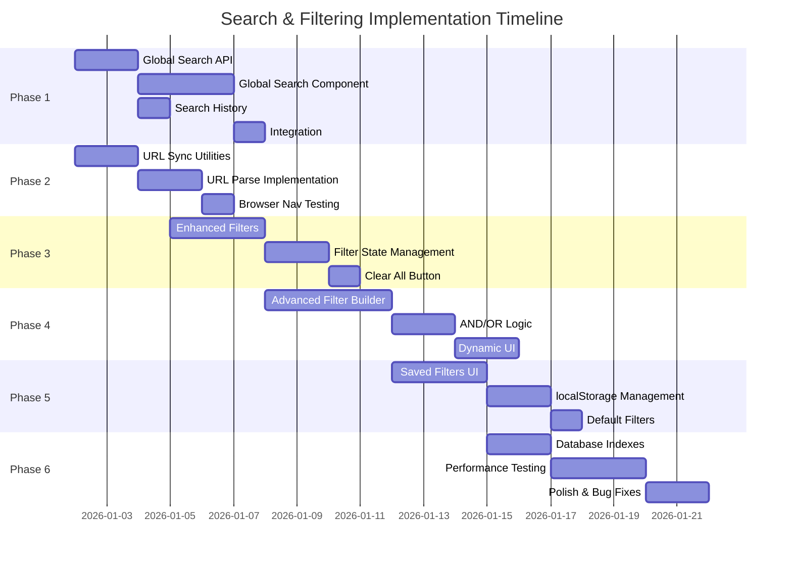

## 11. Entity Relationship Diagram for Filters

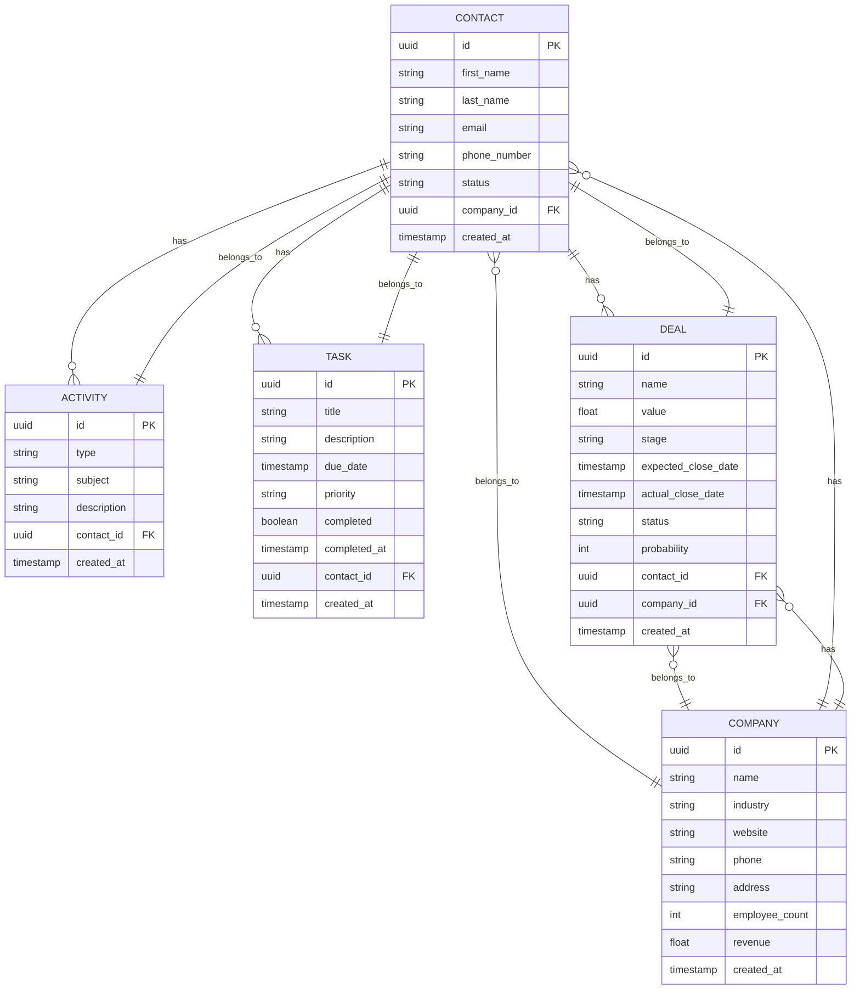

## 12. Database Index Strategy

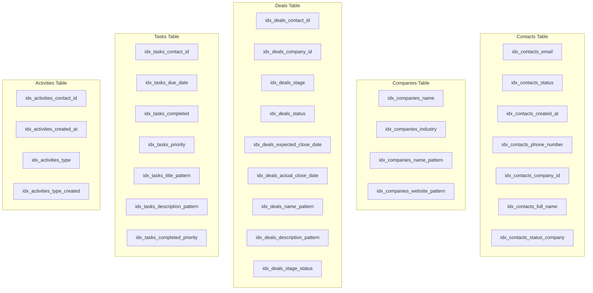

## 13. Search Performance Optimization

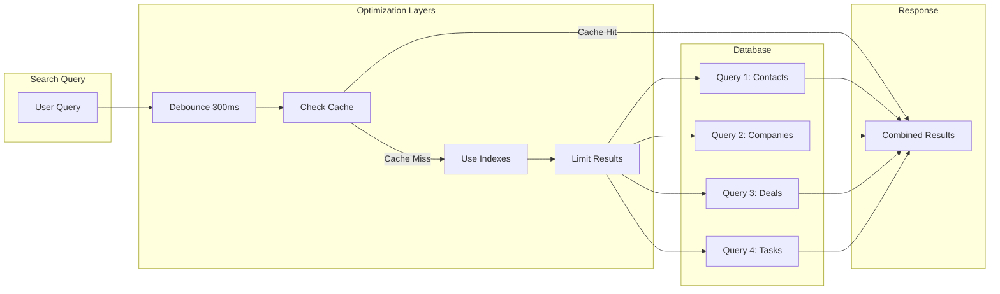

## 14. User Experience Flow - Complete Workflow

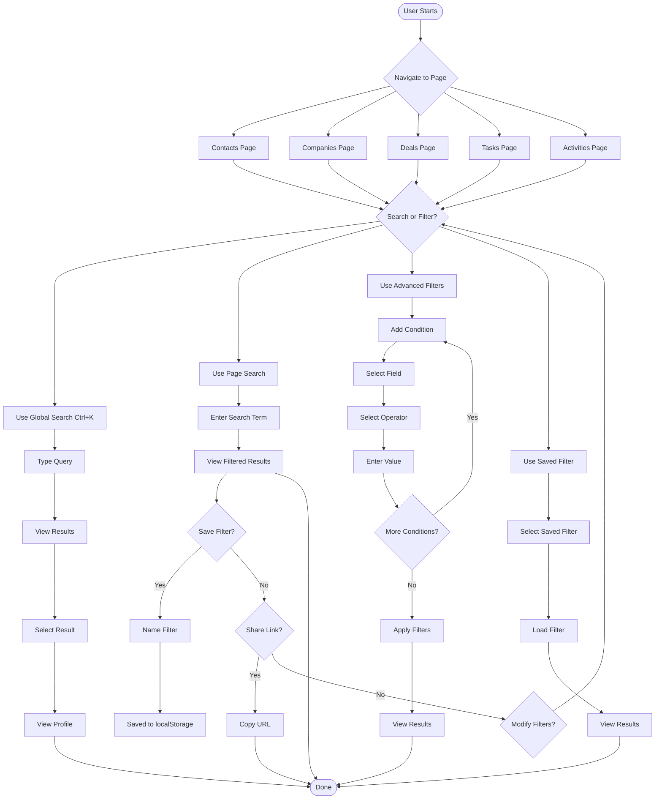

## Summary

These diagrams provide visual representations of:

1. **System Architecture**: Overall component relationships
2. **Global Search Flow**: Step-by-step search interaction
3. **Advanced Filter Builder**: Filter condition management
4. **Saved Filters Flow**: Save/load/delete workflow
5. **URL Parameter Sync**: URL state management
6. **Component Hierarchy**: Component structure
7. **Data Flow**: Request/response lifecycle
8. **Filter State Management**: State transitions
9. **Keyboard Navigation**: Shortcut handling
10. **Implementation Timeline**: Phase-by-phase schedule
11. **Entity Relationships**: Database schema
12. **Index Strategy**: Database optimization
13. **Performance Optimization**: Query optimization layers
14. **Complete User Flow**: End-to-end user journey

These diagrams complement the detailed architecture document and provide visual context for implementation.
